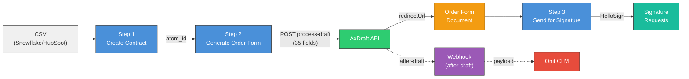

# Onit CLM Automation

Automates the Consumer Direct contract lifecycle in Onit App Builder: create contracts from CSV, generate Order Form documents via AxDraft, and send for HelloSign signature.

## Setup

```bash
pip install -r requirements.txt
cp .env.example .env
# Fill in your API keys in .env
```

## Workflow



The automation runs in three steps:

### Step 1 — Create Contracts

```bash
python onit_client.py create-contract data/your_file.csv
```

Reads a Snowflake/HubSpot CSV export and creates a CLM contract for each row. Looks up the Other Party Contact by email (must already exist in Onit).

**Required CSV columns:** `COMPANY_NAME`, `CONTACT_NAME`, `CONTACT_EMAIL`, `DEAL_ID`, `REQUESTING_EMAIL`

### Step 2 — Generate Order Form (AxDraft API)

```bash
python onit_client.py start-axdraft data/your_file.csv
```

Calls the AxDraft process-draft API to auto-generate Order Form documents. Maps CSV fields (partner type, pricing, trial period, etc.) to AxDraft questionnaire answers.

**Additional CSV columns used:** `PARTNER_TYPE`, `RETAIL_PRICING_FOR_BUILD_PLAN`, `RETAIL_PRICING_FOR_PROTECT_PLAN`, `AXDRAFT_TRIAL_SELECTION`, `EXPIRATION_DATE`

### Step 3 — Send for Signature (HelloSign)

```bash
python onit_client.py send-for-signature <atom_id>
```

Finds the Order Form document, creates a Send for Signature atom with two signers (Other Party Contact + Sales Operations), and triggers HelloSign to send signature request emails.

### Webhook Testing

To test AxDraft `after-draft` webhooks locally:

```bash
python webhook_test.py          # Start local webhook server on port 5555
ngrok http 5555                 # Expose via ngrok (in another terminal)
# Paste ngrok URL + /webhooks/axdraft into AxDraft webhook preferences
```

## Utility Commands

```bash
python onit_client.py list-apps                              # List all app dictionaries
python onit_client.py app-details <dictionary_id>            # Get field definitions for an app
python onit_client.py list-atoms <dictionary_id>             # List all records in an app
python onit_client.py get-atom <atom_id>                     # Get all fields for a record
python onit_client.py execute-reaction <atom_id> <name>      # Fire a reaction on a record
```

## Project Structure

```
onit_client.py          CLI entry point
webhook_test.py         Local webhook receiver for AxDraft testing
.env.example            Template for environment variables
src/
  config.py             Environment variables and dictionary IDs
  api.py                Low-level Onit REST API helpers
  lookups.py            Contact and document lookup helpers
  contracts.py          Step 1: Create contracts from CSV
  axdraft.py            Step 2: AxDraft API document generation
  signature.py          Step 3: Send for HelloSign signature
  utils.py              Utility commands for exploring Onit data
data/                   CSV files and field mapping spreadsheets
docs/                   API documentation and reference files
```
